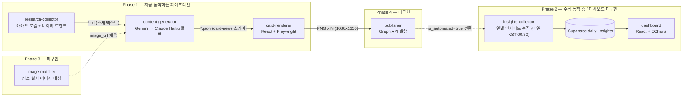

# cardnews — 인스타그램 카드뉴스 자동화

장소/트렌드 리서치 → LLM 카피 구조화 → 카드 이미지 렌더링까지 이어지는 인스타그램 카드뉴스
제작 파이프라인. "AI 워크플로우 자동화" 경험을 엔드투엔드로 보여주는 것과, 자동화 도입
전/후 팔로워 증가율을 정량적으로 측정하는 것이 목표.

전체 로드맵과 각 Phase의 설계 배경은 [`_docs/insta-cardnews-automation-plan.md`](_docs/insta-cardnews-automation-plan.md) 참고.

## 아키텍처

`apps/` 아래 각 프로젝트는 **독립적인 앱**이다 — 한 단계의 출력(텍스트/JSON)을 다음 단계의
입력으로 사람이 CLI로 직접 넘겨야 한다. 아직 이 흐름을 자동으로 이어주는 오케스트레이션은
없다 (아래 "지금 할 수 있는 것" 참고).



| 앱 | 상태 | 역할 |
|---|---|---|
| [`apps/research-collector`](apps/research-collector) | ✅ 동작 | 카카오 로컬 API(장소 후보) + 네이버 검색어트렌드(랭킹)를 합쳐 소재 텍스트 생성 |
| [`apps/content-generator`](apps/content-generator) | ✅ 동작 | 소재 텍스트 → LLM(Gemini 1순위, Claude Haiku 폴백)으로 카드뉴스 JSON 구조화 |
| [`apps/card-renderer`](apps/card-renderer) | ✅ 동작 | 카드뉴스 JSON → React 컴포넌트 렌더링 → Playwright로 PNG 추출 |
| [`apps/image-matcher`](apps/image-matcher) | ⬜ 미구현 | 장소 실사 이미지 자동 매칭 (Phase 3) |
| [`apps/insights-collector`](apps/insights-collector) | ✅ 동작 | 팔로워/도달 등 일별 인사이트 수집 (Phase 2) — GitHub Actions 크론(매일 KST 00:30)으로 Supabase `daily_insights`에 적재 |
| [`apps/publisher`](apps/publisher) | ⬜ 미구현 | Graph API로 인스타그램 발행 (Phase 4) |
| `dashboard` | ⬜ 미구현 | 전/후 비교 대시보드 (Phase 2) |
| `shared/schemas` | ✅ | 앱 간에 공유하는 카드뉴스 JSON 스키마·검증 로직 |
| `design-reference` | ✅ | 카드 레이아웃 스펙 원본 |

## 지금 할 수 있는 것 — Phase 1 파이프라인 전체 실행

세 앱 모두 최초 1회 `npm install` + `.env` 설정이 필요하다. 각 앱의 `.env.example`,
그리고 상세 옵션은 앱별 README(`apps/*/README.md`) 참고.

### 1. 소재 리서치

```bash
cd apps/research-collector
npm run collect
```

`data/topics.json`(사람이 채워두는 시드 데이터)에 정의된 주제들을 트렌드 랭킹으로 정렬하고,
1위 주제의 장소 후보를 텍스트로 저장한다. 콘솔 마지막 줄에 뜨는 `output/*-adopted-*.txt`
경로를 다음 단계에 그대로 쓴다.

```
✔ 채택된 소재(1개) → content-generator --input으로 바로 사용 가능:
  - output/2026-09-27T07-29-13-981Z-adopted-1-강남-야장.txt
```

### 2. 카피 구조화 (LLM)

```bash
cd ../content-generator
npm run generate -- --input ../research-collector/output/<1단계-출력파일>.txt --handle <내 인스타 핸들> --out output/result.json
```

Gemini로 먼저 시도하고, 무료 한도 소진(429)이나 과부하(503)면 Claude Haiku로 자동 전환한다.
어느 프로바이더가 실제로 생성했는지는 `output/result.meta.json`에 남는다.

### 3. 카드 이미지 렌더링

```bash
cd ../card-renderer
npm run render -- --data ../content-generator/output/result.json --out output/result
```

`output/result/1-cover.png`부터 CTA 카드까지 순서대로 PNG가 저장된다. 인스타그램에는
지금은 수동으로 업로드한다(발행 자동화는 Phase 4에서 붙임).

### 2~3단계를 한 번에 실행 (`scripts/pipeline.js`)

저장소 루트에서:

```bash
cd apps/research-collector && npm run collect && cd ../..   # 1단계 (소재 리서치)
npm run pipeline -- --handle <내 인스타 핸들>                  # 2단계 → 3단계
```

- `--input` 생략 시 `apps/research-collector/output`의 **가장 최근** `*-adopted-*.txt`를 입력으로 쓴다
  (직접 지정: `--input apps/research-collector/output/<파일>.txt`)
- `--name <이름>`으로 산출물 이름 지정 (기본: 타임스탬프). 결과는 같은 이름으로 짝지어 저장된다:
  - `apps/content-generator/output/<이름>.json` (+ `.meta.json`)
  - `apps/card-renderer/output/<이름>/*.png`
- 한 단계라도 실패하면 거기서 멈춘다. 각 앱을 자기 폴더에서 실행하므로 앱별 `.env`/`npm install`은 그대로 필요

## 문서

- [`_docs/insta-cardnews-automation-plan.md`](_docs/insta-cardnews-automation-plan.md) — 전체 로드맵, Phase별 설계, 체크리스트
- [`_docs/llm-provider-fallback-plan.md`](_docs/llm-provider-fallback-plan.md) — Gemini→Haiku 폴백 설계 배경
- [`_docs/dev-log/`](_docs/dev-log) — 작업 일지
- [`design-reference/spec.md`](design-reference/spec.md) — 카드 레이아웃 스펙
